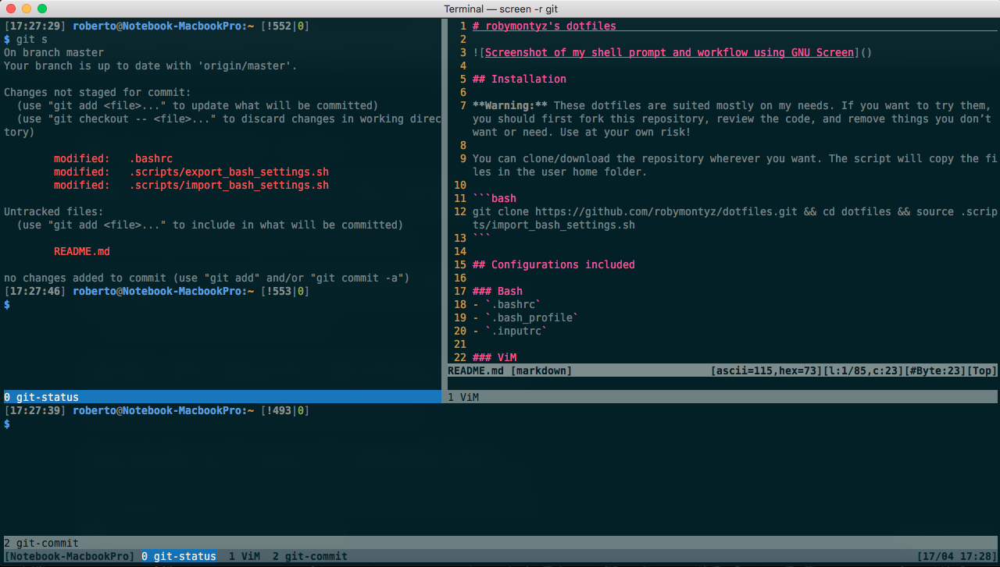

# robymontyz's dotfiles



## Installation

**Warning:** These dotfiles are suited mostly on my needs for macOS. If you want to try them, you should first fork this repository, review the code, and remove things you don’t want or need. **Use at your own risk!**

```bash
git clone https://github.com/robymontyz/dotfiles.git && cd dotfiles && source .scripts/import_bash_settings.sh
```
You can clone/download the repository wherever you want. The script will copy the files in the user home folder.

## Configurations included

* ### Bash
	* `.bashrc`
	* `.bash_profile`
	* `.inputrc`

* ### ViM
	* `.vimrc`
	* italian spelling dictionary

* ### Homebrew
	* install [Homebrew](https://brew.sh), if not installed yet
	* install all the formulae specified in `brew_installed.txt`

* ### Git
	* `.gitconfig`
	* `.gitignore` sample
	* global `.gitignore` sample (`.config/git/ignore`)

* ### GNU Screen
	* `.screenrc`

	**Warning:** You need GNU Screen with support to vertical split:  
		- GNU Screen >4.01 natively supports vertical splitting.  
		- GNU Screen <4.01 may not support vertical splitting without [the patch](http://fungi.yuggoth.org/vsp4s/). Unfortunately the download link is broken.

	In a standard macOS installation, GNU Screen version is probably <4.01, so I strongly recommend to install the latest version with [Homebrew](https://brew.sh).

* ### GnuGP
	* `pubring.kbx`

* ### Install and export scripts
	* `import_bash_settings.sh` (see [Installation](#installation))
	* `export_bash_settings.sh`

	#### Specify the `$BACKUPDIR` in the scripts
	You can manually specify a backup directory where to export files with `export_bash_settings.sh` modifying `$BACKUPDIR` inside the script.  
	Same applies to `import_bash_settings.sh`.

* ### launchd agents (launchd users or macOS only)
	`import_bash_settings.sh` will install launchd agents to start some automated script I wrote. You can find the scripts [here](https://github.com/robymontyz).  
	If you don't want this feature, you can comment these lines.  
	Same applies to `export_bash_settings.sh`.

* ### Crontab
	Deprecated in favor of launchd agents.

* ### Terminal.app and XCode *Solarized Dark* themes (macOS only)
	`import_bash_settings.sh` will install *Solarized Dark* color schemes for Terminal.app and XCode.  
	If you don't want this feature, you can comment these lines.  
	Same applies to `export_bash_settings.sh`.

## Feedback

Suggestions and improvements are [welcome](https://github.com/robymontyz/dotfiles/issues).

## Author

 Follow me on Twitter: [](https://twitter.com/robymontyz)

## Thanks to…

* [StackOverflow](https://stackoverflow.com)
* [sharfah](https://github.com/sharfah/dotfiles) and his fantastic [blog posts](http://fahdshariff.blogspot.it/2011/03/my-bash-profile-part-i.html)
* [mathiasbynens](https://github.com/mathiasbynens/dotfiles) for this README
* [paulirish](https://github.com/paulirish/dotfiles)
* [mbadolato](https://github.com/mbadolato/iTerm2-Color-Schemes) for *Solarized Dark* Terminal.app theme
* [ArtSabintsev](https://github.com/ArtSabintsev/Solarized-Dark-for-Xcode) for *Solarized Dark* XCode theme
