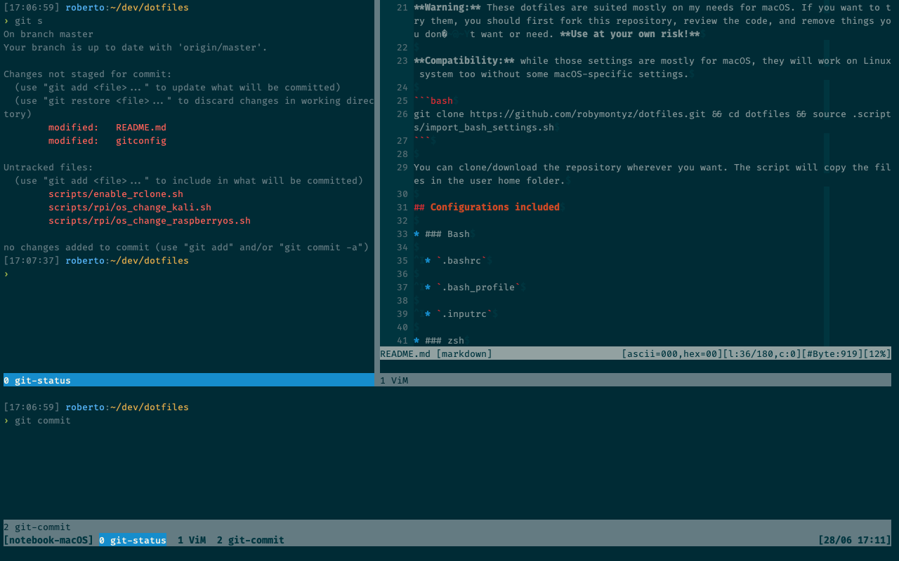

# robymontyz's dotfiles



## Dependencies

* git

* rsync

* screen (version >4.01, see more details below)

* gpg [optional]

* OpenSSH [optional]

* Xcode [optional]

## Installation

**Warning:** These dotfiles are suited mostly on my needs for macOS. If you want to try them, you should first fork this repository, review the code, and remove things you don’t want or need. **Use at your own risk!**

**Compatibility:** while those settings are mostly for macOS, they will work on Linux system too without some macOS-specific settings.

```bash
git clone https://github.com/robymontyz/dotfiles.git && cd dotfiles && source .scripts/import_bash_settings.sh
```

You can clone/download the repository wherever you want. The script will copy the files in the user home folder.

## Configurations included

* ### Bash

	* `.bashrc`

	* `.bash_profile`

	* `.inputrc`

* ### zsh

	* `.zshrc`

	* `.zprofile`

* ### ViM

	* `.vimrc`

	* italian spelling dictionary

	* *Solarized Dark* theme

	* plugins:

		- [Smart Tabs](https://www.vim.org/scripts/script.php?script_id=231)

* ### Git

	* `.gitconfig`

	* `.gitignore` sample

	* global `.gitignore` sample (`.config/git/ignore`)

* ### GNU Screen

	* `.screenrc`

	**Warning**

	```
	You need GNU Screen with support to vertical split:
	- GNU Screen >4.01 natively supports vertical splitting.	
	- GNU Screen <4.01 may not support vertical splitting without [the patch](http://fungi.yuggoth.org/vsp4s/). Unfortunately the download link is broken.
	```

	In a standard macOS installation, GNU Screen version is probably <4.01, so I strongly recommend to install the latest version with [Homebrew](https://brew.sh).

* ### SSH

	* SSH keys

	* `ssh_config` and `sshd_config`

	**N.B.** *My SSH keys, obviously, are not actually included in this repo but you can add them by yourself inside `.ssh/` folder.*

* ### Various personal shell scripts

* ### Install and export scripts

	* `import_bash_settings.sh` (see [Installation](#installation))

	* `export_bash_settings.sh`

	*You can manually specify a backup directory where to export files with `export_bash_settings.sh` modifying `$BACKUPDIR` inside the script.*

	*Same applies to `import_bash_settings.sh`.*

* ### Crontab

	Deprecated in favor of launchd agents.

* ### Homebrew (macOS only)

	* install [Homebrew](https://brew.sh), if not installed yet

	* install all the formulae specified in `install/brew`

	* install all the casks specified in `install/brew-cask`

* ### mas (macOS only)

	* install [mas](https://github.com/mas-cli/mas), if not installed yet

	* install all the apps specified in `install/mas`

* ### QuickLook plugins (macOS only)

	* [QLmarkdown](https://github.com/toland/qlmarkdow)

	* [BetterZipQL](https://macitbetter.com/downloads)

	* [QLColorCode](https://github.com/n8gray/QLColorCode)

	* [qlImageSize](https://github.com/Nyx0uf/qlImageSize)

	* [QLStephen](https://github.com/whomwah/qlstephen)

* ### launchd agents (launchd users or macOS only)

	`import_bash_settings.sh` will install launchd agents to start some automated script I wrote. You can find the scripts [here](https://github.com/robymontyz).

	*If you don't want this feature, you can comment these lines.*

* ### Screen Savers (macOS only)

	* [October30 by lekevicius](https://github.com/lekevicius/october30)

* ### Terminal.app and XCode *Solarized Dark* themes (macOS only)

	`import_bash_settings.sh` will install *Solarized Dark* color schemes for Terminal.app and XCode.

* ### SublimeText preferences

* ### PyPI

	* install all the [pip](https://pypi.org) modules specified in `install/pip`

* ### GnuGP

	* `pubring.kbx`

	* `openpgp-revocs.d`

	* `private-keys-v1.d`

	* `ownertrust`

	**N.B.** *My PGP keyring, obviously, is not actually included in this repo but you can add it by yourself inside `.gpg/` folder.*

## Feedback

Suggestions and improvements are [welcome](https://github.com/robymontyz/dotfiles/issues).

## Author

Follow me on Twitter: [](https://twitter.com/robymontyz)

## Thanks

* [StackOverflow](https://stackoverflow.com)
* [sharfah](https://github.com/sharfah/dotfiles) and his fantastic [blog posts](http://fahdshariff.blogspot.it/2011/03/my-bash-profile-part-i.html)
* [mathiasbynens](https://github.com/mathiasbynens/dotfiles) for this README
* [paulirish](https://github.com/paulirish/dotfiles)
* [Michael Geddes](https://www.vim.org/scripts/script.php?script_id=231) for Smart Tabs plugin for ViM
* [Ethan Schoonover - altercation](https://github.com/altercation/vim-colors-solarized) for creating *Solarized Dark* and its ViM version
* [mbadolato](https://github.com/mbadolato/iTerm2-Color-Schemes) for *Solarized Dark* Terminal.app theme
* [ArtSabintsev](https://github.com/ArtSabintsev/Solarized-Dark-for-Xcode) for *Solarized Dark* XCode theme
